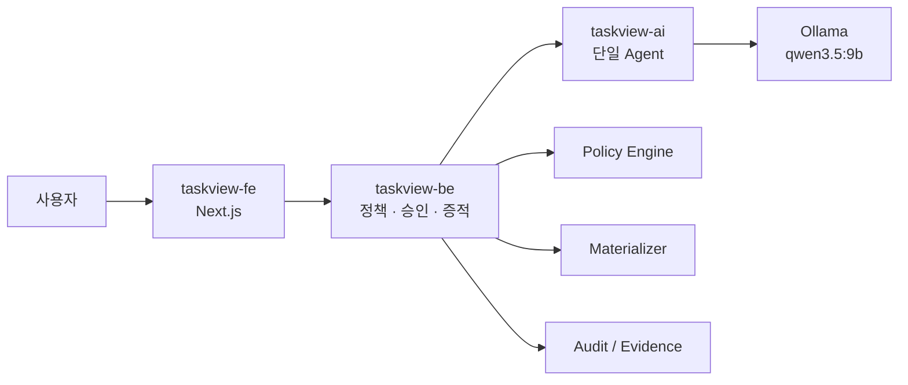

# TaskView BE

AI가 제안한 View 계획을 결정론적으로 검증하고, 사용자·보안 세션·소유자 승인·Task View 증적을 PostgreSQL에 영구 저장하는 API입니다. 전체 Task View 계약은 JSONB로 보존하면서 상태·목적·대상·TTL은 별도 컬럼으로 인덱싱합니다.



FE는 AI를 직접 호출하지 않습니다. 따라서 모델의 제안은 항상 BE의 정책 검사와 소유자 승인 경계를 통과합니다.

## 실행

AI 서버(`localhost:8100`)를 먼저 실행한 뒤:

```bash
make install
make db
make dev
```

AI 서버 없이 계약을 확인할 때는:

```bash
TASKVIEW_BE_FAKE_AI=true make dev
```

API 문서는 `/docs`, 상태 확인은 `/health`입니다.

### 첫 데이터 소유자 만들기

공개 회원가입 계정은 안전하게 `requester` 역할만 받습니다. 데이터 승인 권한은 로컬 관리 명령으로 별도 생성합니다.

```bash
make create-owner
```

명령이 `owner@taskview.dev`의 비밀번호를 터미널에서 노출 없이 입력받습니다. 자동화 환경에서는 `TASKVIEW_NEW_USER_PASSWORD` 환경 변수와 `scripts/create_user.py`의 `--email`, `--name`, `--role` 옵션을 사용할 수 있습니다.

## 세 저장소 함께 실행

호스트에서 `ollama serve`와 `ollama pull qwen3.5:9b`를 실행한 뒤 이 저장소에서:

```bash
docker compose up --build
```

Compose는 형제 디렉터리의 `taskview-ai`, `taskview-fe`를 각각 빌드하고 AI 컨테이너가 macOS 호스트의 Ollama에 연결하도록 설정되어 있습니다. Apple Silicon의 Metal 가속을 사용하기 위해 Ollama 자체는 호스트에서 실행합니다.

## 핵심 API

- `POST /v1/auth/signup` — 요청자 계정 생성 및 세션 발급
- `POST /v1/auth/login` — 로그인 및 세션 발급
- `GET /v1/auth/me` — 현재 사용자 조회
- `POST /v1/auth/session/refresh` — 기존 세션 폐기 후 새 세션 발급
- `POST /v1/auth/logout` — 현재 세션 폐기
- `GET /v1/taskviews` — 요청자는 자신의 View, 소유자·관리자는 전체 View 조회
- `POST /v1/taskviews/preview` — 목적을 계획·정책·미리보기로 컴파일
- `POST /v1/taskviews/{id}/decision` — 데이터 소유자·관리자 승인/거절
- `GET /v1/taskviews/{id}` — 현재 상태 조회
- `POST /v1/taskviews/{id}/refine` — 목적 보완 후 재검토
- `GET /v1/taskviews/{id}/evidence` — 승인된 View의 Evidence Contract

## 인증과 권한

- 비밀번호는 Argon2 권장 설정으로 단방향 해시합니다.
- 로그인 토큰은 384-bit 난수이며 DB에는 SHA-256 해시만 보관합니다.
- 세션은 기본 7일 후 만료되고 로그아웃·갱신 시 즉시 폐기됩니다.
- 5회 연속 로그인 실패 시 기본 15분 동안 계정을 잠급니다.
- `requester`는 자신의 View만 볼 수 있고, `data_owner`와 `admin`만 승인할 수 있습니다.
- API는 존재 여부 노출을 막기 위해 다른 사용자의 View를 `404`로 응답합니다.
- 승인·보완 상태 전이는 조건부 갱신하며, 승인된 Evidence는 다시 수정할 수 없습니다.

프론트엔드는 원문 세션 토큰을 JavaScript에 전달하지 않고 HttpOnly·SameSite 쿠키에만 저장합니다. 프로덕션에서는 Secure 속성도 활성화됩니다.

## PostgreSQL 저장 구조

- `users` — 정규화 이메일, Argon2 해시, 역할, 잠금·로그인 상태
- `auth_sessions` — 토큰 해시, 만료·마지막 사용·폐기 시각
- `task_views.id` — Task View 식별자
- `status`, `purpose`, `audience`, `ttl_days` — 조회·운영용 컬럼
- `payload JSONB` — 계획, 정책 결과, 미리보기, 승인 및 Evidence Contract 전체
- `created_at`, `updated_at` — 생성 및 갱신 시각

애플리케이션 시작 시 테이블과 조회 인덱스를 멱등적으로 생성합니다. Docker 데이터는 `taskview_postgres_data` volume에 유지됩니다.

## 운영 전 교체할 부분

- 샘플 `materializer.py` → 읽기 전용 웨어하우스 작업 큐
- 로컬 계정 → 사내 SSO 또는 IdP 연동 및 이메일 검증/복구
- 단일 프로세스 감사 정보 → append-only audit store
