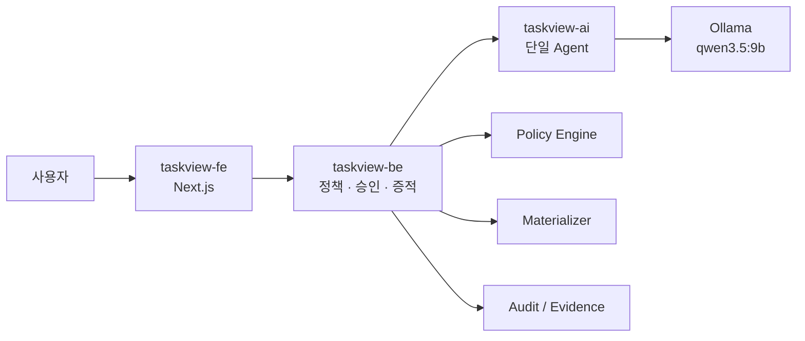

# TaskView BE

AI가 제안한 View 계획을 결정론적으로 검증하고, 소유자 승인과 Task View 증적을 관리하는 API입니다. 현재 저장소는 해커톤용으로 인메모리 저장소와 샘플 materializer를 사용하며, 서비스 재시작 시 데이터가 초기화됩니다.



FE는 AI를 직접 호출하지 않습니다. 따라서 모델의 제안은 항상 BE의 정책 검사와 소유자 승인 경계를 통과합니다.

## 실행

AI 서버(`localhost:8100`)를 먼저 실행한 뒤:

```bash
make install
make dev
```

AI 서버 없이 계약을 확인할 때는:

```bash
TASKVIEW_BE_FAKE_AI=true make dev
```

API 문서는 `/docs`, 상태 확인은 `/health`입니다.

## 세 저장소 함께 실행

호스트에서 `ollama serve`와 `ollama pull qwen3.5:9b`를 실행한 뒤 이 저장소에서:

```bash
docker compose up --build
```

Compose는 형제 디렉터리의 `taskview-ai`, `taskview-fe`를 각각 빌드하고 AI 컨테이너가 macOS 호스트의 Ollama에 연결하도록 설정되어 있습니다. Apple Silicon의 Metal 가속을 사용하기 위해 Ollama 자체는 호스트에서 실행합니다.

## 핵심 API

- `POST /v1/taskviews/preview` — 목적을 계획·정책·미리보기로 컴파일
- `POST /v1/taskviews/{id}/decision` — 데이터 소유자 승인/거절
- `GET /v1/taskviews/{id}` — 현재 상태 조회
- `POST /v1/taskviews/{id}/refine` — 목적 보완 후 재검토
- `GET /v1/taskviews/{id}/evidence` — 승인된 View의 Evidence Contract

## 운영 전 교체할 부분

- 인메모리 `store.py` → PostgreSQL
- 샘플 `materializer.py` → 읽기 전용 웨어하우스 작업 큐
- 문자열 reviewer → 사내 SSO/RBAC 신원
- 단일 프로세스 감사 정보 → append-only audit store
